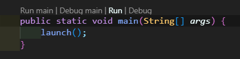

# Puzzle Piece Solver

## Deskripsi

Puzzle Piece Solver dibuat dengan JavaFX untuk menyelesaikan persoalan menaruh puzzle piece, memvisualisasikan dan menyimpan solusi dari sebuah teka-teki berbentuk grid.

## Requirements

1. JavaFX
2. Extension JavaFX vscode
3. Java 23
4. Extension Java vscode

## Cara Menjalankan

1. Masuk ke src/stima-tucilone
2. Buka src/stima-tucilone/
   src/main/java/tucilone/stime/App.java
3. Tekan Run

   

## Author

13523036
Yonatan Edward Njoto
